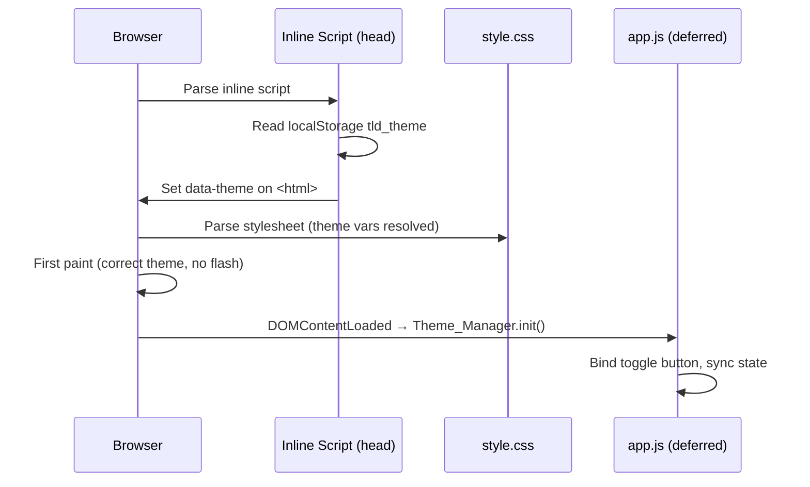
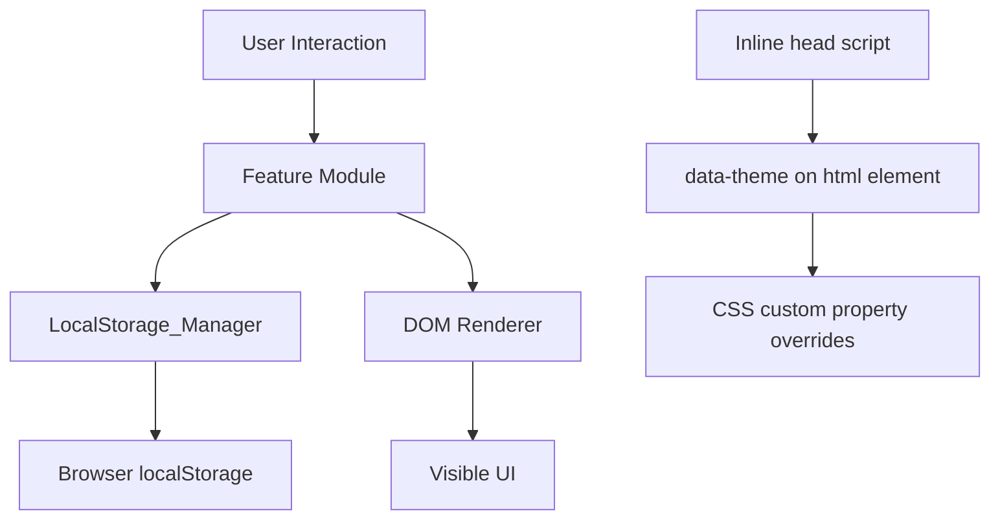

# Design Document: Dashboard Enhancements

## Overview

This document describes the technical design for five enhancements to the existing To-Do List Life Dashboard: light/dark theme toggle, custom display name in the greeting, configurable Pomodoro timer duration, duplicate task prevention, and task sort order. All changes are contained within the existing three files (`index.html`, `css/style.css`, `js/app.js`). No new files, frameworks, or build steps are introduced.

The existing architecture is preserved: IIFE-based modules inside a single `app.js`, CSS custom properties in `:root`, and all persistence via `LocalStorage_Manager`. Three new modules are added (`Theme_Manager`, `Name_Manager`, `Timer_Config`) and two existing modules (`Todo_Manager`, `Todo_List`) are extended.

---

## Architecture

### Module map (after enhancements)

| Module | New / Extended | Responsibility |
|---|---|---|
| `LocalStorage_Manager` | Extended | Adds 4 new keys; all reads/writes still flow through here |
| `Theme_Manager` | **New** | Reads, applies, and persists the active color theme |
| `Name_Manager` | **New** | Reads, stores, and provides the user's display name |
| `Timer_Config` | **New** | Reads, stores, and provides the custom timer duration |
| `Greeting_Widget` | Extended | Accepts a name parameter; builds formatted greeting string |
| `Focus_Timer` | Extended | Accepts a configurable initial duration from `Timer_Config` |
| `Todo_Manager` | Extended | Duplicate detection on `addTask` and `updateTask` |
| `Todo_List` | Extended | Sort control, inline duplicate error messages |
| `QuickLinks_Manager` | Unchanged | — |
| `QuickLinks_Panel` | Unchanged | — |


### Theme application strategy (no-flash)

The theme must be applied **before the first paint** to avoid a visible flash of the wrong theme. The approach is an inline `<script>` in `<head>` — before the stylesheet link — that reads `localStorage.getItem('tld_theme')` and sets `document.documentElement.dataset.theme` (or `document.body.dataset.theme`) synchronously. Because this runs before the CSS is parsed, the `:root[data-theme="light"]` overrides are already in effect when the browser paints the first frame.



### High-level data flow



---

## Components and Interfaces

### Updated LocalStorage_Manager

```js
const KEYS = {
  tasks:         'tld_tasks',
  links:         'tld_links',
  theme:         'tld_theme',          // NEW: 'dark' | 'light'
  name:          'tld_name',           // NEW: string
  timerDuration: 'tld_timer_duration', // NEW: number (minutes, 1–180)
  sortOrder:     'tld_sort_order',     // NEW: 'creation'|'alpha-asc'|'alpha-desc'|'completed-last'
};

// Existing methods unchanged. New methods:
LocalStorage_Manager.saveTheme(theme: string): void
LocalStorage_Manager.loadTheme(): string        // returns '' if missing
LocalStorage_Manager.saveName(name: string): void
LocalStorage_Manager.loadName(): string         // returns '' if missing
LocalStorage_Manager.saveTimerDuration(minutes: number): void
LocalStorage_Manager.loadTimerDuration(): number | null  // null if missing/invalid
LocalStorage_Manager.saveSortOrder(order: string): void
LocalStorage_Manager.loadSortOrder(): string    // returns '' if missing
```


### Theme_Manager (new)

```js
// Valid values
const THEMES = { DARK: 'dark', LIGHT: 'light' };
const DEFAULT_THEME = THEMES.DARK;

Theme_Manager.init(): void
  // Reads tld_theme; applies theme to <html data-theme="...">; binds toggle button.

Theme_Manager.getTheme(): 'dark' | 'light'
  // Returns current active theme.

Theme_Manager.setTheme(theme: string): void
  // Validates, applies data-theme attribute, persists, updates toggle aria-label.

Theme_Manager.toggle(): void
  // Calls setTheme with the opposite of getTheme().

// Internal
Theme_Manager._apply(theme: string): void
  // Sets document.documentElement.dataset.theme = theme
  // Updates toggle button aria-label:
  //   light → "Switch to dark mode"
  //   dark  → "Switch to light mode"
```

The toggle button is placed as a fixed-position control in the top-right corner of the viewport (see HTML changes below). It is always visible without scrolling on all screen sizes.

### Name_Manager (new)

```js
Name_Manager.init(): void
  // Reads tld_name from localStorage; stores in memory.

Name_Manager.getName(): string
  // Returns the trimmed stored name, or '' if absent.

Name_Manager.setName(raw: string): void
  // Trims raw. If result is non-empty, persists to tld_name.
  // If result is empty, removes tld_name from storage (or saves '').
  // Calls Greeting_Widget.updateGreeting() to re-render.
```

### Timer_Config (new)

```js
const TIMER_MIN = 1;
const TIMER_MAX = 180;
const TIMER_DEFAULT = 25;

Timer_Config.init(): void
  // Reads tld_timer_duration; validates; stores resolved value in memory.
  // Passes resolved duration to Focus_Timer before Focus_Timer.init() runs.

Timer_Config.getDuration(): number
  // Returns current duration in minutes (always in [1,180]).

Timer_Config.setDuration(minutes: number): boolean
  // Validates minutes is an integer in [1,180].
  // If valid: persists to tld_timer_duration, notifies Focus_Timer. Returns true.
  // If invalid: returns false without mutating state.
```


### Extended Greeting_Widget

The existing `getGreeting(hour)` pure function is kept unchanged. A new pure helper `formatGreeting(hour, name)` is added:

```js
Greeting_Widget.formatGreeting(hour: number, name: string): string
  // If name.trim() is non-empty:  return `${getGreeting(hour)}, ${name.trim()}!`
  // If name.trim() is empty:      return getGreeting(hour)

Greeting_Widget.updateGreeting(): void
  // Re-reads Name_Manager.getName() and updates the greeting DOM element.
  // Called from Name_Manager.setName() and from the existing _tick() loop.
```

The `_tick()` function is updated to call `formatGreeting(hour, Name_Manager.getName())` instead of `getGreeting(hour)` when updating the greeting element.

### Extended Focus_Timer

```js
// New: accepts initial seconds from Timer_Config
Focus_Timer.init(initialSeconds?: number): void
  // If initialSeconds provided, uses it; otherwise reads Timer_Config.getDuration() * 60.
  // Binds the Duration_Input change handler.

Focus_Timer.setInitialSeconds(seconds: number): void
  // Updates INITIAL_SECONDS equivalent; resets display if not running.

Focus_Timer.reset(): void
  // Already public. Now resets to Timer_Config.getDuration() * 60 (not hardcoded 1500).
  // Re-enables the Duration_Input after reset.

// Duration input interaction
Focus_Timer._onDurationChange(minutes: number): void
  // Called when Duration_Input changes. Delegates to Timer_Config.setDuration().
  // If timer is running: ignores the change (input is disabled so this shouldn't fire).
  // If timer is stopped: updates display.

// Updated render: disables/enables Duration_Input based on state.running
Focus_Timer._render(): void
  // As before, plus: durationInput.disabled = state.running
```

### Extended Todo_Manager

```js
// Return values for addTask and updateTask are extended:
// { type: 'ok', task: Task }             — success
// null                                   — empty/whitespace input (unchanged)
// { type: 'duplicate' }                  — new duplicate signal

Todo_Manager.addTask(description: string): Task | null | { type: 'duplicate' }
  // 1. Trim description. If empty → return null.
  // 2. Check _isDuplicate(description, null). If true → return { type: 'duplicate' }.
  // 3. Create and push task; persist. Return task.

Todo_Manager.updateTask(id: string, description: string): boolean | { type: 'duplicate' }
  // 1. Trim description. If empty → return false.
  // 2. Find task by id. If not found → return false.
  // 3. Check _isDuplicate(description, id). If true → return { type: 'duplicate' }.
  // 4. Update and persist. Return true.

// Internal helper (pure — extractable for testing)
Todo_Manager._isDuplicate(description: string, excludeId: string | null): boolean
  // Returns true if any task whose id !== excludeId has
  //   task.description.trim().toLowerCase() === description.trim().toLowerCase()
```

### Extended Todo_List

```js
// New state: active sort order
let _sortOrder = 'creation'; // read from LocalStorage_Manager on init

// New: sort helper (pure — easily testable)
Todo_List._sortTasks(tasks: Task[], order: string): Task[]
  // 'creation':      returns tasks in original array order (slice copy)
  // 'alpha-asc':     sort by description.toLowerCase() ascending
  // 'alpha-desc':    sort by description.toLowerCase() descending
  // 'completed-last': incomplete first (completed===false), then completed,
  //                   preserving relative order within each group (stable sort)

// Updated render: applies _sortTasks before rendering
Todo_List.render(): void
  // const sorted = _sortTasks(Todo_Manager.getTasks(), _sortOrder);
  // Renders sorted list.

// New: error message display
Todo_List._showAddError(message: string): void
Todo_List._clearAddError(): void
Todo_List._showEditError(id: string, message: string): void
Todo_List._clearEditError(id: string): void

// New: sort control binding
Todo_List._bindSortControl(): void
  // Listens to 'change' on the sort select; updates _sortOrder,
  // persists via LocalStorage_Manager.saveSortOrder(), calls render().
```


---

## Data Models

### Updated LocalStorage key table

| Key | Type | Valid values | Default |
|---|---|---|---|
| `tld_tasks` | JSON array of Task | — | `[]` |
| `tld_links` | JSON array of QuickLink | — | `[]` |
| `tld_theme` | string | `'dark'` \| `'light'` | `'dark'` |
| `tld_name` | string | any trimmed string, or `''` | `''` |
| `tld_timer_duration` | number | integer 1–180 | `25` |
| `tld_sort_order` | string | `'creation'` \| `'alpha-asc'` \| `'alpha-desc'` \| `'completed-last'` | `'creation'` |

### Task (unchanged)

```json
{ "id": "1722355200000_abc12", "description": "Buy groceries", "completed": false }
```

### Theme preference

Stored as a plain string under `tld_theme`. Only `'dark'` and `'light'` are valid; any other value (including missing) resolves to `'dark'`.

### Timer duration

Stored as a JSON number under `tld_timer_duration`. A non-numeric JSON value, a number outside [1, 180], a non-integer, or a missing key all resolve to `25`.

### Sort order

Stored as a plain string under `tld_sort_order`. Only the four defined values are valid; any other value resolves to `'creation'`.

---

## HTML Changes

### 1. Inline no-flash theme script (in `<head>`, before `<link>`)

```html
<script>
  (function() {
    var t = localStorage.getItem('tld_theme');
    document.documentElement.dataset.theme = (t === 'light') ? 'light' : 'dark';
  })();
</script>
```

### 2. Theme toggle button (fixed position, outside `.dashboard`)

```html
<button
  id="theme-toggle"
  class="btn btn-ghost theme-toggle-btn"
  type="button"
  aria-label="Switch to light mode"
>🌙</button>
```

Placed just after `<body>` opens, before `.dashboard`. Positioned via CSS `position: fixed; top: var(--sp-4); right: var(--sp-4);`.

### 3. Greeting card — Name_Input

```html
<form id="name-form" class="name-form" novalidate aria-label="Set display name">
  <input
    id="name-input"
    class="text-input"
    type="text"
    placeholder="Enter your name…"
    aria-label="Your display name"
    maxlength="50"
    autocomplete="off"
  />
  <button class="btn btn-primary btn-sm" type="submit" aria-label="Set name">Set</button>
</form>
```

Added below the existing `.date-display` paragraph inside the greeting card.

### 4. Timer card — Duration_Input

```html
<div class="duration-row">
  <label for="timer-duration" class="duration-label">Minutes</label>
  <input
    id="timer-duration"
    class="text-input duration-input"
    type="number"
    min="1"
    max="180"
    value="25"
    aria-label="Timer duration in minutes"
  />
</div>
```

Added above the existing `.timer-display` element inside the timer card.

### 5. Todo card — Sort_Control

```html
<div class="sort-row">
  <label for="todo-sort" class="sort-label">Sort</label>
  <select id="todo-sort" class="sort-select" aria-label="Sort tasks by">
    <option value="creation">Creation order</option>
    <option value="alpha-asc">A → Z</option>
    <option value="alpha-desc">Z → A</option>
    <option value="completed-last">Incomplete first</option>
  </select>
</div>
```

Added between the `.section-title` and the `#todo-add-form` inside the todo card.

### 6. Todo add-form — duplicate error placeholder

```html
<p id="todo-add-error" class="field-error" role="alert" aria-live="polite" hidden></p>
```

Added immediately after `#todo-add-form` closing tag. Revealed (hidden removed) when a duplicate error occurs.


---

## CSS Changes

### 1. Light theme overrides via `[data-theme="light"]`

```css
[data-theme="light"] {
  --clr-bg:          #f4f5f7;
  --clr-surface:     #ffffff;
  --clr-surface-alt: #eef0f5;
  --clr-border:      #d0d4e0;
  --clr-text:        #1a1d27;
  --clr-text-muted:  #5a6080;
  --clr-shadow-card: 0 4px 24px rgba(0, 0, 0, 0.10);
}
```

Because all color usages in the existing CSS reference custom properties (`var(--clr-bg)`, etc.), overriding only the `:root` variables via the `[data-theme="light"]` selector is sufficient to re-theme the entire page. No component-level CSS needs to change.

### 2. Theme toggle button

```css
.theme-toggle-btn {
  position: fixed;
  top: var(--sp-4);
  right: var(--sp-4);
  z-index: 100;
  font-size: var(--fs-lg);
  padding: var(--sp-2);
  border-radius: var(--radius-sm);
  line-height: 1;
}
```

### 3. Duration row (timer card)

```css
.duration-row {
  display: flex;
  align-items: center;
  gap: var(--sp-2);
  justify-content: center;
  margin-bottom: var(--sp-4);
}

.duration-label {
  font-size: var(--fs-sm);
  color: var(--clr-text-muted);
}

.duration-input {
  width: 5rem;
  text-align: center;
}

.duration-input:disabled {
  opacity: 0.5;
  cursor: not-allowed;
}
```

### 4. Sort control row (todo card)

```css
.sort-row {
  display: flex;
  align-items: center;
  gap: var(--sp-2);
  margin-bottom: var(--sp-4);
}

.sort-label {
  font-size: var(--fs-sm);
  color: var(--clr-text-muted);
  white-space: nowrap;
}

.sort-select {
  padding: var(--sp-1) var(--sp-3);
  background-color: var(--clr-surface-alt);
  border: 1px solid var(--clr-border);
  border-radius: var(--radius-sm);
  color: var(--clr-text);
  font-size: var(--fs-sm);
  font-family: var(--font-base);
  cursor: pointer;
}

.sort-select:focus {
  outline: none;
  border-color: var(--clr-accent);
  box-shadow: 0 0 0 3px rgba(108, 99, 255, 0.25);
}
```

### 5. Name form (greeting card)

```css
.name-form {
  display: flex;
  gap: var(--sp-2);
  margin-top: var(--sp-4);
  flex-wrap: wrap;
}
```

### 6. Inline field error messages

```css
.field-error {
  font-size: var(--fs-xs);
  color: var(--clr-danger);
  margin-top: var(--sp-1);
  min-height: 1.2em;
}

.field-error[hidden] {
  display: none;
}
```


---

## Correctness Properties

*A property is a characteristic or behavior that should hold true across all valid executions of a system — essentially, a formal statement about what the system should do. Properties serve as the bridge between human-readable specifications and machine-verifiable correctness guarantees.*

### Property 1: Theme toggle is a self-inverse (round-trip)

*For any* starting theme value (`'dark'` or `'light'`), calling `Theme_Manager.toggle()` twice shall return the active theme to its original value.

**Validates: Requirements 1.2**

---

### Property 2: Theme persistence round-trip

*For any* valid theme value (`'dark'` or `'light'`), calling `Theme_Manager.setTheme(theme)` shall result in `LocalStorage_Manager.loadTheme()` returning that same theme value.

**Validates: Requirements 1.4**

---

### Property 3: Invalid stored theme defaults to dark

*For any* string value that is not `'light'` (including `null`, `undefined`, `''`, or an arbitrary string), `Theme_Manager.init()` with that value in storage shall apply `'dark'` as the active theme.

**Validates: Requirements 1.6**

---

### Property 4: Greeting format with name

*For any* integer hour `h` in [0, 23] and any non-empty, non-whitespace-only name string `n`, `Greeting_Widget.formatGreeting(h, n)` shall return a string equal to `getGreeting(h) + ', ' + n.trim() + '!'`.

**Validates: Requirements 2.3**

---

### Property 5: Greeting format without name

*For any* integer hour `h` in [0, 23], `Greeting_Widget.formatGreeting(h, '')` shall return exactly `getGreeting(h)` with no trailing punctuation or name suffix.

**Validates: Requirements 2.4**

---

### Property 6: Name persistence — non-empty input is trimmed and stored

*For any* string `s` whose trimmed value is non-empty, `Name_Manager.setName(s)` shall result in `Name_Manager.getName()` returning `s.trim()`.

**Validates: Requirements 2.2**

---

### Property 7: Name persistence — whitespace input clears the name

*For any* string composed entirely of whitespace characters (spaces, tabs, newlines), `Name_Manager.setName(s)` shall result in `Name_Manager.getName()` returning `''`.

**Validates: Requirements 2.6**

---

### Property 8: Timer duration validation — valid inputs accepted, invalid rejected

*For any* integer `n`, `Timer_Config.setDuration(n)` shall return `true` if and only if `1 <= n <= 180`.

**Validates: Requirements 3.2**

---

### Property 9: Timer duration persistence round-trip

*For any* integer `n` in [1, 180], `Timer_Config.setDuration(n)` followed by `Timer_Config.getDuration()` shall return `n`.

**Validates: Requirements 3.3**

---

### Property 10: Timer reset uses configured duration

*For any* integer `n` in [1, 180], after calling `Timer_Config.setDuration(n)` and then `Focus_Timer.reset()`, `Focus_Timer.getState().remaining` shall equal `n * 60`.

**Validates: Requirements 3.5**

---

### Property 11: Invalid stored timer duration defaults to 25

*For any* value stored in `tld_timer_duration` that is not an integer in [1, 180] (including `null`, `0`, `181`, non-numeric strings), `Timer_Config.init()` shall resolve to a duration of `25` minutes.

**Validates: Requirements 3.7**

---

### Property 12: Duplicate detection is case-insensitive and trim-aware

*For any* two strings `s1` and `s2`, `Todo_Manager._isDuplicate(s1, s2, null)` shall return `true` if and only if `s1.trim().toLowerCase() === s2.trim().toLowerCase()`.

**Validates: Requirements 4.5**

---

### Property 13: Duplicate add leaves the list unchanged

*For any* task list containing at least one task, and any description string that (after trim and lowercase) matches an existing task's description, calling `Todo_Manager.addTask(description)` shall return `{ type: 'duplicate' }` and the task list length shall remain unchanged.

**Validates: Requirements 4.1**

---

### Property 14: Duplicate edit leaves the task unchanged

*For any* task list with at least two tasks, attempting to update a task's description to a value that (after trim and lowercase) matches any *other* task's description shall return `{ type: 'duplicate' }` and leave the task's description unchanged.

**Validates: Requirements 4.3**

---

### Property 15: alpha-asc sort produces non-decreasing case-insensitive order

*For any* array of Task objects, `Todo_List._sortTasks(tasks, 'alpha-asc')` shall return an array where for every adjacent pair `(tasks[i], tasks[i+1])`, `tasks[i].description.toLowerCase() <= tasks[i+1].description.toLowerCase()`.

**Validates: Requirements 5.4**

---

### Property 16: alpha-desc sort produces non-increasing case-insensitive order

*For any* array of Task objects, `Todo_List._sortTasks(tasks, 'alpha-desc')` shall return an array where for every adjacent pair `(tasks[i], tasks[i+1])`, `tasks[i].description.toLowerCase() >= tasks[i+1].description.toLowerCase()`.

**Validates: Requirements 5.5**

---

### Property 17: completed-last sort places all incomplete tasks before all completed tasks

*For any* array of Task objects, `Todo_List._sortTasks(tasks, 'completed-last')` shall return an array where no task with `completed === true` appears before any task with `completed === false`.

**Validates: Requirements 5.6**

---

### Property 18: creation sort preserves original array order

*For any* array of Task objects, `Todo_List._sortTasks(tasks, 'creation')` shall return an array whose element order is identical to the input order.

**Validates: Requirements 5.7**

---

### Property 19: Sort order persistence round-trip

*For any* valid sort order value (`'creation'`, `'alpha-asc'`, `'alpha-desc'`, `'completed-last'`), persisting it via `LocalStorage_Manager.saveSortOrder(order)` and then loading it with `LocalStorage_Manager.loadSortOrder()` shall return the same value.

**Validates: Requirements 5.8**

---

### Property 20: Invalid stored sort order defaults to creation

*For any* value stored in `tld_sort_order` that is not one of the four valid sort order strings (including `null`, `''`, or arbitrary strings), `Todo_List` on init shall use `'creation'` as the active sort order.

**Validates: Requirements 5.10**


---

## Error Handling

| Scenario | Handling |
|---|---|
| `tld_theme` missing or invalid | `Theme_Manager` defaults to `'dark'`; persists the default on first use |
| `tld_name` missing | `Name_Manager.getName()` returns `''`; greeting shows without name |
| `tld_timer_duration` missing, non-numeric, or out of [1,180] | `Timer_Config` defaults to `25`; persists the default on first use |
| `tld_sort_order` missing or unrecognized | `Todo_List` defaults to `'creation'`; persists the default on first use |
| `addTask` with whitespace-only input | Returns `null`; no error shown (existing behavior unchanged) |
| `addTask` with duplicate description | Returns `{ type: 'duplicate' }`; Todo_List shows inline error; input retains focus |
| `updateTask` with duplicate description | Returns `{ type: 'duplicate' }`; Todo_List shows inline error in edit row; input retains focus |
| Duration_Input changed while timer running | Input is `disabled`; change event cannot fire; ignored |
| Duration_Input value outside [1,180] | `Timer_Config.setDuration()` returns `false`; display unchanged; input reverts to last valid value |
| localStorage unavailable | All `_save` calls silently catch; all `_load` calls return defaults; modules hold state in memory |

---

## Testing Strategy

### PBT applicability

This feature contains pure logic functions (sort comparator, greeting formatter, duplicate checker, validation helpers) with input spaces large enough that property-based testing adds meaningful value beyond example-based tests. PBT is applicable and the recommended library is **[fast-check](https://github.com/dubzzz/fast-check)** (same choice as the original spec).

### Unit tests (example-based)

- Theme_Manager.init() with `'light'` stored → `data-theme="light"` on `<html>`
- Theme_Manager.init() with `'dark'` stored → `data-theme="dark"` on `<html>`
- Theme_Manager.init() with no stored value → `data-theme="dark"`
- Theme toggle button aria-label reflects current state after toggle
- Name_Manager.init() with name stored → getName() returns stored value
- Name_Manager.init() with no stored value → getName() returns ''
- Greeting_Widget._tick() with name set → greeting text includes name
- Timer duration input is disabled when timer is running; re-enabled after reset
- Duration_Input value 0 is rejected; 1 is accepted; 180 is accepted; 181 is rejected
- Duplicate add shows error message; error clears when input is modified
- Duplicate edit shows error; error clears when edit input is modified
- Sort_Control has exactly 4 options with correct values
- Changing sort control re-renders list in new order (spot check with 3 tasks)
- Completed-last sort: completed tasks appear after all incomplete tasks (concrete example)

### Property-based tests (fast-check, minimum 100 iterations each)

| Test | Property | Tag |
|---|---|---|
| Theme toggle round-trip | 1 | `Feature: dashboard-enhancements, Property 1` |
| Theme persistence round-trip | 2 | `Feature: dashboard-enhancements, Property 2` |
| Invalid stored theme → dark default | 3 | `Feature: dashboard-enhancements, Property 3` |
| formatGreeting with non-empty name | 4 | `Feature: dashboard-enhancements, Property 4` |
| formatGreeting with empty name | 5 | `Feature: dashboard-enhancements, Property 5` |
| setName trims and stores | 6 | `Feature: dashboard-enhancements, Property 6` |
| setName with whitespace clears name | 7 | `Feature: dashboard-enhancements, Property 7` |
| setDuration accepts iff in [1,180] | 8 | `Feature: dashboard-enhancements, Property 8` |
| Timer duration persistence round-trip | 9 | `Feature: dashboard-enhancements, Property 9` |
| reset uses configured duration | 10 | `Feature: dashboard-enhancements, Property 10` |
| Invalid stored duration → 25 default | 11 | `Feature: dashboard-enhancements, Property 11` |
| _isDuplicate case-insensitive/trim | 12 | `Feature: dashboard-enhancements, Property 12` |
| Duplicate add leaves list unchanged | 13 | `Feature: dashboard-enhancements, Property 13` |
| Duplicate edit leaves task unchanged | 14 | `Feature: dashboard-enhancements, Property 14` |
| alpha-asc sort → non-decreasing order | 15 | `Feature: dashboard-enhancements, Property 15` |
| alpha-desc sort → non-increasing order | 16 | `Feature: dashboard-enhancements, Property 16` |
| completed-last → incomplete before completed | 17 | `Feature: dashboard-enhancements, Property 17` |
| creation sort → original order preserved | 18 | `Feature: dashboard-enhancements, Property 18` |
| Sort order persistence round-trip | 19 | `Feature: dashboard-enhancements, Property 19` |
| Invalid stored sort order → creation default | 20 | `Feature: dashboard-enhancements, Property 20` |

### Dual approach

Unit tests cover specific examples, DOM interactions, and integration points between modules. Property tests verify universal invariants across the full valid input space — particularly for the pure logic functions (`formatGreeting`, `_isDuplicate`, `_sortTasks`, `setDuration`, `setName`). Together they provide comprehensive correctness coverage runnable with `node test.js` after `npm install fast-check`.
