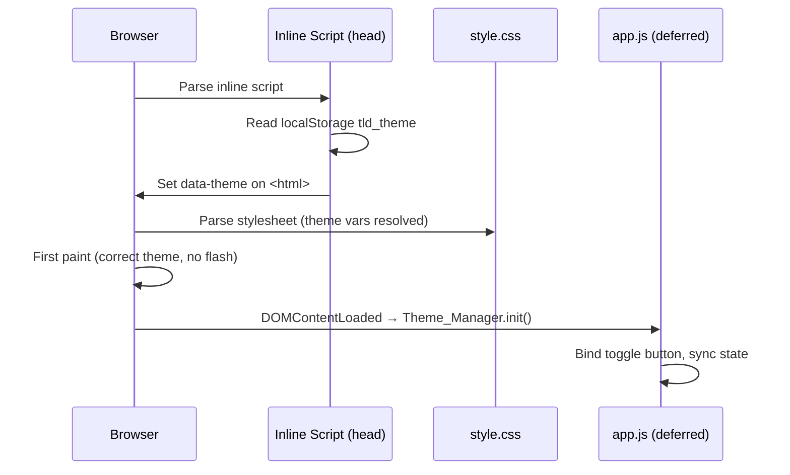
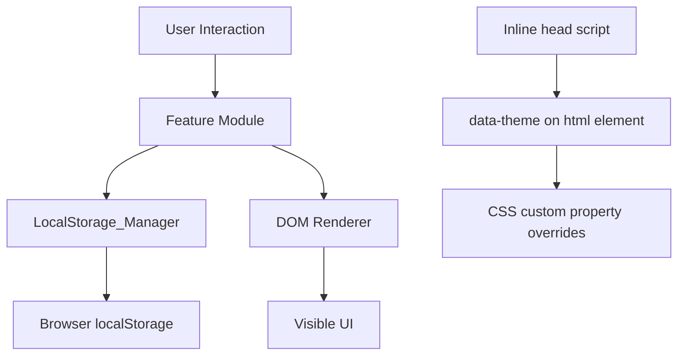

# Design Document: Dashboard Enhancements

## Overview

This document describes the technical design for five enhancements to the existing To-Do List Life Dashboard: light/dark theme toggle, custom display name in the greeting, configurable Pomodoro timer duration, duplicate task prevention, and task sort order. All changes are contained within the existing three files (`index.html`, `css/style.css`, `js/app.js`). No new files, frameworks, or build steps are introduced.

The existing architecture is preserved: IIFE-based modules inside a single `app.js`, CSS custom properties in `:root`, and all persistence via `LocalStorage_Manager`. Three new modules are added (`Theme_Manager`, `Name_Manager`, `Timer_Config`) and two existing modules (`Todo_Manager`, `Todo_List`) are extended.

---

## Architecture

### Module map (after enhancements)

| Module | New / Extended | Responsibility |
|---|---|---|
| `LocalStorage_Manager` | Extended | Adds 4 new keys; all reads/writes still flow through here |
| `Theme_Manager` | **New** | Reads, applies, and persists the active color theme |
| `Name_Manager` | **New** | Reads, stores, and provides the user's display name |
| `Timer_Config` | **New** | Reads, stores, and provides the custom timer duration |
| `Greeting_Widget` | Extended | Accepts a name parameter; builds formatted greeting string |
| `Focus_Timer` | Extended | Accepts a configurable initial duration from `Timer_Config` |
| `Todo_Manager` | Extended | Duplicate detection on `addTask` and `updateTask` |
| `Todo_List` | Extended | Sort control, inline duplicate error messages |
| `QuickLinks_Manager` | Unchanged | — |
| `QuickLinks_Panel` | Unchanged | — |


### Theme application strategy (no-flash)

The theme must be applied **before the first paint** to avoid a visible flash of the wrong theme. The approach is an inline `<script>` in `<head>` — before the stylesheet link — that reads `localStorage.getItem('tld_theme')` and sets `document.documentElement.dataset.theme` (or `document.body.dataset.theme`) synchronously. Because this runs before the CSS is parsed, the `:root[data-theme="light"]` overrides are already in effect when the browser paints the first frame.



### High-level data flow



---

## Components and Interfaces

### Updated LocalStorage_Manager

```js
const KEYS = {
  tasks:         'tld_tasks',
  links:         'tld_links',
  theme:         'tld_theme',          // NEW: 'dark' | 'light'
  name:          'tld_name',           // NEW: string
  timerDuration: 'tld_timer_duration', // NEW: number (minutes, 1–180)
  sortOrder:     'tld_sort_order',     // NEW: 'creation'|'alpha-asc'|'alpha-desc'|'completed-last'
};

// Existing methods unchanged. New methods:
LocalStorage_Manager.saveTheme(theme: string): void
LocalStorage_Manager.loadTheme(): string        // returns '' if missing
LocalStorage_Manager.saveName(name: string): void
LocalStorage_Manager.loadName(): string         // returns '' if missing
LocalStorage_Manager.saveTimerDuration(minutes: number): void
LocalStorage_Manager.loadTimerDuration(): number | null  // null if missing/invalid
LocalStorage_Manager.saveSortOrder(order: string): void
LocalStorage_Manager.loadSortOrder(): string    // returns '' if missing
```


### Theme_Manager (new)

```js
// Valid values
const THEMES = { DARK: 'dark', LIGHT: 'light' };
const DEFAULT_THEME = THEMES.DARK;

Theme_Manager.init(): void
  // Reads tld_theme; applies theme to <html data-theme="...">; binds toggle button.

Theme_Manager.getTheme(): 'dark' | 'light'
  // Returns current active theme.

Theme_Manager.setTheme(theme: string): void
  // Validates, applies data-theme attribute, persists, updates toggle aria-label.

Theme_Manager.toggle(): void
  // Calls setTheme with the opposite of getTheme().

// Internal
Theme_Manager._apply(theme: string): void
  // Sets document.documentElement.dataset.theme = theme
  // Updates toggle button aria-label:
  //   light → "Switch to dark mode"
  //   dark  → "Switch to light mode"
```

The toggle button is placed as a fixed-position control in the top-right corner of the viewport (see HTML changes below). It is always visible without scrolling on all screen sizes.

### Name_Manager (new)

```js
Name_Manager.init(): void
  // Reads tld_name from localStorage; stores in memory.

Name_Manager.getName(): string
  // Returns the trimmed stored name, or '' if absent.

Name_Manager.setName(raw: string): void
  // Trims raw. If result is non-empty, persists to tld_name.
  // If result is empty, removes tld_name from storage (or saves '').
  // Calls Greeting_Widget.updateGreeting() to re-render.
```

### Timer_Config (new)

```js
const TIMER_MIN = 1;
const TIMER_MAX = 180;
const TIMER_DEFAULT = 25;

Timer_Config.init(): void
  // Reads tld_timer_duration; validates; stores resolved value in memory.
  // Passes resolved duration to Focus_Timer before Focus_Timer.init() runs.

Timer_Config.getDuration(): number
  // Returns current duration in minutes (always in [1,180]).

Timer_Config.setDuration(minutes: number): boolean
  // Validates minutes is an integer in [1,180].
  // If valid: persists to tld_timer_duration, notifies Focus_Timer. Returns true.
  // If invalid: returns false without mutating state.
```


### Extended Greeting_Widget

The existing `getGreeting(hour)` pure function is kept unchanged. A new pure helper `formatGreeting(hour, name)` is added:

```js
Greeting_Widget.formatGreeting(hour: number, name: string): string
  // If name.trim() is non-empty:  return `${getGreeting(hour)}, ${name.trim()}!`
  // If name.trim() is empty:      return getGreeting(hour)

Greeting_Widget.updateGreeting(): void
  // Re-reads Name_Manager.getName() and updates the greeting DOM element.
  // Called from Name_Manager.setName() and from the existing _tick() loop.
```

The `_tick()` function is updated to call `formatGreeting(hour, Name_Manager.getName())` instead of `getGreeting(hour)` when updating the greeting element.

### Extended Focus_Timer

```js
// New: accepts initial seconds from Timer_Config
Focus_Timer.init(initialSeconds?: number): void
  // If initialSeconds provided, uses it; otherwise reads Timer_Config.getDuration() * 60.
  // Binds the Duration_Input change handler.

Focus_Timer.setInitialSeconds(seconds: number): void
  // Updates INITIAL_SECONDS equivalent; resets display if not running.

Focus_Timer.reset(): void
  // Already public. Now resets to Timer_Config.getDuration() * 60 (not hardcoded 1500).
  // Re-enables the Duration_Input after reset.

// Duration input interaction
Focus_Timer._onDurationChange(minutes: number): void
  // Called when Duration_Input changes. Delegates to Timer_Config.setDuration().
  // If timer is running: ignores the change (input is disabled so this shouldn't fire).
  // If timer is stopped: updates display.

// Updated render: disables/enables Duration_Input based on state.running
Focus_Timer._render(): void
  // As before, plus: durationInput.disabled = state.running
```

### Extended Todo_Manager

```js
// Return values for addTask and updateTask are extended:
// { type: 'ok', task: Task }             — success
// null                                   — empty/whitespace input (unchanged)
// { type: 'duplicate' }                  — new duplicate signal

Todo_Manager.addTask(description: string): Task | null | { type: 'duplicate' }
  // 1. Trim description. If empty → return null.
  // 2. Check _isDuplicate(description, null). If true → return { type: 'duplicate' }.
  // 3. Create and push task; persist. Return task.

Todo_Manager.updateTask(id: string, description: string): boolean | { type: 'duplicate' }
  // 1. Trim description. If empty → return false.
  // 2. Find task by id. If not found → return false.
  // 3. Check _isDuplicate(description, id). If true → return { type: 'duplicate' }.
  // 4. Update and persist. Return true.

// Internal helper (pure — extractable for testing)
Todo_Manager._isDuplicate(description: string, excludeId: string | null): boolean
  // Returns true if any task whose id !== excludeId has
  //   task.description.trim().toLowerCase() === description.trim().toLowerCase()
```

### Extended Todo_List

```js
// New state: active sort order
let _sortOrder = 'creation'; // read from LocalStorage_Manager on init

// New: sort helper (pure — easily testable)
Todo_List._sortTasks(tasks: Task[], order: string): Task[]
  // 'creation':      returns tasks in original array order (slice copy)
  // 'alpha-asc':     sort by description.toLowerCase() ascending
  // 'alpha-desc':    sort by description.toLowerCase() descending
  // 'completed-last': incomplete first (completed===false), then completed,
  //                   preserving relative order within each group (stable sort)

// Updated render: applies _sortTasks before rendering
Todo_List.render(): void
  // const sorted = _sortTasks(Todo_Manager.getTasks(), _sortOrder);
  // Renders sorted list.

// New: error message display
Todo_List._showAddError(message: string): void
Todo_List._clearAddError(): void
Todo_List._showEditError(id: string, message: string): void
Todo_List._clearEditError(id: string): void

// New: sort control binding
Todo_List._bindSortControl(): void
  // Listens to 'change' on the sort select; updates _sortOrder,
  // persists via LocalStorage_Manager.saveSortOrder(), calls render().
```

