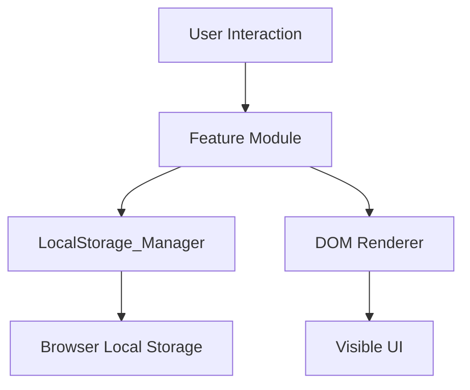

# Design Document: To-Do List Life Dashboard

## Overview

The To-Do List Life Dashboard is a zero-dependency, single-page web application built entirely with HTML, CSS, and vanilla JavaScript. It runs directly from the filesystem without a server. The four feature areas — Greeting, Focus Timer, To-Do List, and Quick Links — are implemented as loosely coupled JavaScript modules that each own their data and rendering logic, wired together by a thin `main.js` entry point. All persistence flows through a single `LocalStorage_Manager` module.

---

## Architecture

The application follows a **Module Pattern** using ES5-compatible IIFE-based modules or a simple ES6 module structure (type="module" on the script tag). Each feature area is a self-contained component. A shared `storage.js` utility handles all Local Storage reads and writes.

```
index.html
├── css/
│   └── style.css
└── js/
    └── app.js          ← single JS file (all modules inside)
```

Because the project rules allow only one JS file, all modules live inside `app.js` as function-scoped objects / immediately-invoked module patterns, organized by logical sections with clear comments.

### High-level data flow



### Module map

| Module | Responsibility |
|---|---|
| `LocalStorage_Manager` | Read/write JSON blobs under known keys |
| `Greeting_Widget` | Clock tick loop, date/time formatting, greeting logic |
| `Focus_Timer` | Countdown state machine, interval management |
| `Todo_Manager` | Task CRUD, ID generation |
| `Todo_List` | Task rendering, inline edit, DOM event wiring |
| `QuickLinks_Manager` | Links CRUD |
| `QuickLinks_Panel` | Link rendering, add/remove form |

---

## Components and Interfaces

### LocalStorage_Manager

```js
// Keys
const STORAGE_KEYS = {
  tasks: 'tld_tasks',
  links: 'tld_links'
};

// Interface
LocalStorage_Manager.saveTasks(tasks: Task[]): void
LocalStorage_Manager.loadTasks(): Task[]
LocalStorage_Manager.saveLinks(links: QuickLink[]): void
LocalStorage_Manager.loadLinks(): QuickLink[]
```

- Uses `JSON.stringify` / `JSON.parse`
- Wraps parse in try/catch; returns `[]` on any failure

### Greeting_Widget

```js
Greeting_Widget.init(): void          // starts the 1-second interval
Greeting_Widget.getGreeting(hour: number): string   // pure, testable
Greeting_Widget.formatTime(date: Date): string      // "HH:MM:SS"
Greeting_Widget.formatDate(date: Date): string      // "Weekday, DD Month YYYY"
Greeting_Widget._tick(): void         // called each second; updates DOM
```

### Focus_Timer

```js
// State
{ totalSeconds: 1500, remaining: 1500, running: false, intervalId: null }

Focus_Timer.init(): void
Focus_Timer.start(): void
Focus_Timer.stop(): void
Focus_Timer.reset(): void
Focus_Timer._tick(): void             // called by setInterval
Focus_Timer.formatDisplay(seconds: number): string  // "MM:SS"
```

### Todo_Manager

```js
// Task shape
{ id: string, description: string, completed: boolean }

Todo_Manager.init(): void
Todo_Manager.getTasks(): Task[]
Todo_Manager.addTask(description: string): Task | null
Todo_Manager.updateTask(id: string, description: string): boolean
Todo_Manager.toggleComplete(id: string): boolean
Todo_Manager.deleteTask(id: string): boolean
Todo_Manager._generateId(): string    // timestamp + random suffix
```

### Todo_List (renderer)

```js
Todo_List.init(): void
Todo_List.render(): void              // re-renders entire list from Todo_Manager.getTasks()
Todo_List._renderTask(task: Task): HTMLElement
Todo_List._bindAddForm(): void
Todo_List._enterEditMode(id: string): void
Todo_List._exitEditMode(id: string, save: boolean): void
```

### QuickLinks_Manager

```js
// QuickLink shape
{ id: string, label: string, url: string }

QuickLinks_Manager.init(): void
QuickLinks_Manager.getLinks(): QuickLink[]
QuickLinks_Manager.addLink(label: string, url: string): QuickLink | null
QuickLinks_Manager.removeLink(id: string): boolean
```

### QuickLinks_Panel (renderer)

```js
QuickLinks_Panel.init(): void
QuickLinks_Panel.render(): void
QuickLinks_Panel._renderLink(link: QuickLink): HTMLElement
QuickLinks_Panel._bindAddForm(): void
```

---

## Data Models

### Task

```json
{
  "id": "1722355200000_abc12",
  "description": "Buy groceries",
  "completed": false
}
```

| Field | Type | Constraints |
|---|---|---|
| `id` | string | Unique, non-empty. Format: `{timestamp}_{5-char random}` |
| `description` | string | Non-empty, non-whitespace-only after trim |
| `completed` | boolean | `false` on creation |

### QuickLink

```json
{
  "id": "1722355200001_xyz99",
  "label": "GitHub",
  "url": "https://github.com"
}
```

| Field | Type | Constraints |
|---|---|---|
| `id` | string | Unique, non-empty |
| `label` | string | Non-empty, non-whitespace-only after trim |
| `url` | string | Non-empty, non-whitespace-only after trim |

### Local Storage layout

| Key | Value |
|---|---|
| `tld_tasks` | JSON array of Task objects |
| `tld_links` | JSON array of QuickLink objects |

---

## Correctness Properties

*A property is a characteristic or behavior that should hold true across all valid executions of a system — essentially, a formal statement about what the system should do. Properties serve as the bridge between human-readable specifications and machine-verifiable correctness guarantees.*

### Property 1: Task list persistence round-trip

*For any* array of Task objects, saving that array to Local Storage via `LocalStorage_Manager.saveTasks` and then loading it back via `LocalStorage_Manager.loadTasks` shall produce an array equal to the original.

**Validates: Requirements 2.2, 2.3**

---

### Property 2: Quick links persistence round-trip

*For any* array of QuickLink objects, saving that array via `LocalStorage_Manager.saveLinks` and loading it back via `LocalStorage_Manager.loadLinks` shall produce an array equal to the original.

**Validates: Requirements 2.2, 2.4**

---

### Property 3: Corrupted storage returns empty lists

*For any* string value that is not valid JSON (or for the absence of the storage key), calling `LocalStorage_Manager.loadTasks` and `LocalStorage_Manager.loadLinks` shall each return an empty array `[]`.

**Validates: Requirements 2.5**

---

### Property 4: Greeting covers every hour of the day

*For any* integer hour `h` in the range [0, 23], `Greeting_Widget.getGreeting(h)` shall return exactly one of "Good Morning", "Good Afternoon", or "Good Evening" with no unhandled case.

**Validates: Requirements 3.3, 3.4, 3.5**

---

### Property 5: Greeting correctness by range

*For any* integer hour `h`:
- If `h` is in [5, 11], `getGreeting(h)` === "Good Morning"
- If `h` is in [12, 17], `getGreeting(h)` === "Good Afternoon"
- If `h` is in [0, 4] or [18, 23], `getGreeting(h)` === "Good Evening"

**Validates: Requirements 3.3, 3.4, 3.5**

---

### Property 6: Timer reset is idempotent to initial state

*For any* timer state (any value of `remaining` between 0 and 1500), calling `Focus_Timer.reset()` shall always set `remaining` to 1500 and `running` to `false`.

**Validates: Requirements 4.5**

---

### Property 7: Adding a valid task grows the list by one

*For any* existing task list and any non-empty (non-whitespace-only) description string, calling `Todo_Manager.addTask(description)` shall increase the task list length by exactly 1.

**Validates: Requirements 5.2**

---

### Property 8: Adding a whitespace-only description leaves the list unchanged

*For any* string composed entirely of whitespace characters (spaces, tabs, newlines), calling `Todo_Manager.addTask(description)` shall leave the task list length unchanged.

**Validates: Requirements 5.3**

---

### Property 9: All task IDs are unique

*For any* sequence of N valid `addTask` calls, the resulting task list shall contain N tasks with N distinct `id` values.

**Validates: Requirements 5.2**

---

### Property 10: Task completion toggle is a round-trip

*For any* Task, calling `Todo_Manager.toggleComplete(id)` twice shall return the Task's `completed` field to its original value.

**Validates: Requirements 6.4**

---

### Property 11: Deleting a task removes exactly that task

*For any* task list with at least one task, calling `Todo_Manager.deleteTask(id)` shall decrease the list length by exactly 1 and no task with that `id` shall remain in the list.

**Validates: Requirements 6.6**

---

### Property 12: Adding a valid quick link grows the list by one

*For any* quick links list and any non-empty label and URL strings, calling `QuickLinks_Manager.addLink(label, url)` shall increase the list length by exactly 1.

**Validates: Requirements 7.4**

---

### Property 13: Adding a quick link with empty label or URL leaves the list unchanged

*For any* quick links list and any combination where label or url is empty or whitespace-only, calling `QuickLinks_Manager.addLink(label, url)` shall leave the list length unchanged.

**Validates: Requirements 7.5**

---

### Property 14: Removing a quick link removes exactly that link

*For any* quick links list with at least one entry, calling `QuickLinks_Manager.removeLink(id)` shall decrease the list length by exactly 1 and no link with that `id` shall remain.

**Validates: Requirements 7.7**

---

## Error Handling

| Scenario | Handling |
|---|---|
| Local Storage unavailable (private browsing, quota exceeded) | `saveTasks`/`saveLinks` catch exceptions silently; data is held in memory for the session |
| Unparseable Local Storage JSON | `loadTasks`/`loadLinks` return `[]`; app starts fresh |
| `addTask` with whitespace-only input | Returns `null`; UI shows no change |
| `addLink` with missing label or URL | Returns `null`; UI shows no change |
| `updateTask` / `deleteTask` called with unknown ID | Returns `false`; no mutation |
| Timer tick after countdown reaches 0 | `clearInterval` is called; display stays at "00:00" |
| URL submitted without protocol prefix | The `url` field is stored as-is; the browser handles interpretation when the link is clicked |

---

## Testing Strategy

Because the feature is a pure-frontend vanilla JS application with no build tooling required, property-based tests are written as self-contained test scripts that can be run in Node.js (or directly in the browser console). The recommended PBT library is **[fast-check](https://github.com/dubzzz/fast-check)** for Node-based tests.

### Unit tests (example-based)
- Timer initializes at 1500 seconds
- Timer tick decrements by 1
- Timer stops at 0 and calls clearInterval
- `formatTime` returns correct HH:MM:SS strings for known dates
- `formatDisplay` returns "25:00" for 1500, "00:00" for 0
- Edit mode pre-fills the input with the existing description
- Whitespace-edit is discarded and original description is restored
- Quick link opens in a new tab (`target="_blank"`)

### Property-based tests (fast-check, minimum 100 iterations each)
Each test is tagged with its property number from this design document.

| Test | Property | Tag |
|---|---|---|
| Task list save → load round-trip | 1 | `Feature: todo-life-dashboard, Property 1` |
| Quick links save → load round-trip | 2 | `Feature: todo-life-dashboard, Property 2` |
| Corrupted storage returns empty array | 3 | `Feature: todo-life-dashboard, Property 3` |
| Greeting covers all 24 hours | 4 | `Feature: todo-life-dashboard, Property 4` |
| Greeting correctness by range | 5 | `Feature: todo-life-dashboard, Property 5` |
| Timer reset always returns to 1500 | 6 | `Feature: todo-life-dashboard, Property 6` |
| addTask grows list by 1 | 7 | `Feature: todo-life-dashboard, Property 7` |
| Whitespace input leaves list unchanged | 8 | `Feature: todo-life-dashboard, Property 8` |
| Task IDs are unique | 9 | `Feature: todo-life-dashboard, Property 9` |
| toggleComplete is round-trip | 10 | `Feature: todo-life-dashboard, Property 10` |
| deleteTask removes exactly one task | 11 | `Feature: todo-life-dashboard, Property 11` |
| addLink grows list by 1 | 12 | `Feature: todo-life-dashboard, Property 12` |
| Invalid addLink leaves list unchanged | 13 | `Feature: todo-life-dashboard, Property 13` |
| removeLink removes exactly one link | 14 | `Feature: todo-life-dashboard, Property 14` |

### Dual approach
- Unit tests cover specific examples, boundary conditions, and DOM interactions
- Property tests verify universal invariants across the full valid input space
- Together they provide comprehensive correctness coverage without a formal test framework setup requirement on the user side (the tests can be run with `node test.js` after `npm install fast-check`)
